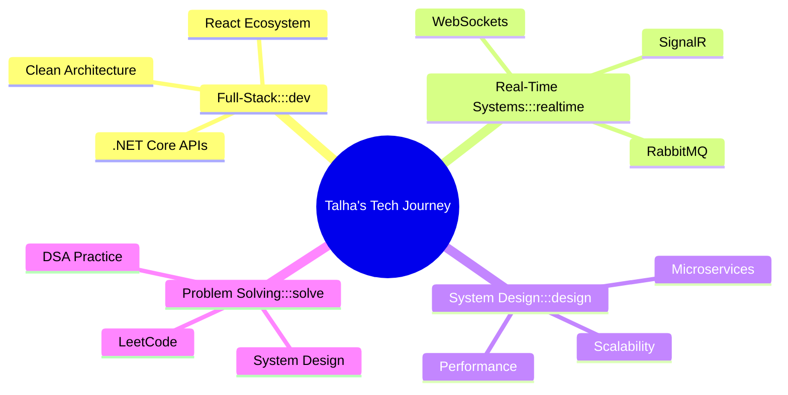

# 👋 Hi, I'm Talha Malek

### Full-Stack Developer | .NET & React Enthusiast | Problem Solver

  
  
  
  
  

---

## 🚀 About Me

I'm a passionate software engineer focused on building **scalable, real-world applications** using modern technologies. I thrive on transforming complex problems into elegant, working solutions that make a difference.

**💻 Quick Overview:**

- 🎯 **Current Focus:** System Design • Real-Time Communication • Backend Optimization
- 🔨 **Working With:** React • .NET Core • PostgreSQL
- 🚀 **Exploring:** SignalR • RabbitMQ • Microservices • Performance Tuning
- 💬 **Ask Me About:** C# • .NET Core • React • PostgreSQL • REST APIs
- ⚡ **Fun Fact:** I enjoy turning complex ideas into simple, working products

- 🔭 Building full-stack projects with **React, .NET Core, and PostgreSQL**
- 🌱 Deep diving into **system design, real-time communication, and backend optimization**
- 👯 Open to collaborating on **full-stack, backend, and open-source projects**
- 💡 Always learning, always growing

---

## 🛠️ Tech Stack

### Languages

### Frontend Development

### Backend Development

### Databases

### Real-Time & Messaging

### Tools & DevOps

---

## 🔥 Featured Projects

<table>
<tr>
<td width="50%">

### 🚘 SmartRide Connect
**Ride-sharing & Social Platform**

A comprehensive platform combining ride-sharing functionality with social networking features for both web and mobile platforms.

`React` `SignalR` `.NET Core` `PostgreSQL`

</td>
<td width="50%">

### 🏗️ Makes Easy
**Multi-Service Platform**

A robust multi-service platform featuring role-based access control and streamlined service management.

`ASP.NET MVC` `PostgreSQL` `Bootstrap`

</td>
</tr>
<tr>
<td width="50%">

### 💬 Real-Time Chat Systems
**WebSocket Communication**

Building scalable real-time messaging systems using modern technologies for instant communication.

`SignalR` `RabbitMQ` `.NET Core` `React`

</td>
<td width="50%">

### 🧠 DSA Practice
**Problem Solving**

Continuously sharpening algorithmic thinking and problem-solving skills through consistent practice.

`Data Structures` `Algorithms` `LeetCode`

</td>
</tr>
</table>

---

## 📊 GitHub Stats

  
  

  

---

## 🎯 Current Focus

---

## 📫 Let's Connect!

I'm always excited to connect with fellow developers, collaborate on interesting projects, or discuss tech!

**💼 Portfolio:** [talha.rf.gd](https://talha.rf.gd)  
**📧 Open for:** Collaborations | Open Source | Freelance Projects

---

### ⭐ If you find my work interesting, consider starring a repository!

